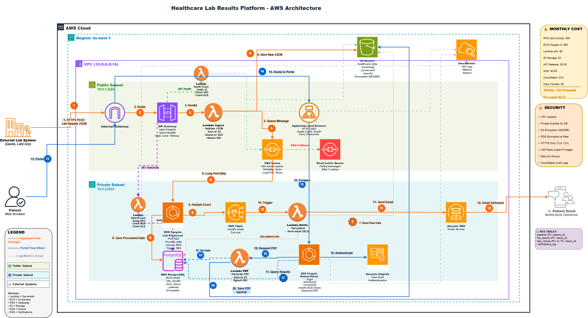

# Healthcare Lab Results Processing Platform - Final Project

## Architecture Decisions

**Architecture Diagram**

### Data Flow Documentation**

📥 **Flow 1: Data Ingestion (Lab → Email)**

1. An external lab sends a patient’s results as a JSON file to our public API.
2. The request goes through the Internet Gateway and reaches **API Gateway**.
3. **API Gateway** checks access (API keys) and rate limits. If OK, it calls the **Ingestion Lambda**.
4. The **Ingestion Lambda** does three things:
   * Checks the JSON format.
   * Saves a copy of the original file to **S3** (audit).
   * Sends a message to **SQS** with the S3 file location.
5. **SQS** stores the message safely. It **does not push**; it waits for a worker to read it.
6. An **ECS Fargate** worker long-polls SQS. When it gets a message, it:

   * Reads the raw JSON from **S3**.
   * Cleans and validates the data.
   * Saves processed data into **RDS**.
   * Publishes a notification to **SNS**.
7. **SNS** triggers the **Notification Lambda**.
8. The **Notification Lambda** looks up the patient’s email in **RDS** and uses **SES** to send an email saying results are ready.

---

💻 **Flow 2: Patient Portal (Login → Download)**
9) The patient gets the email and opens the portal in the browser.
10) The request goes through the Internet Gateway to the **ALB** (load balancer).
11) The **ALB**:

* Handles HTTPS.
* Checks health
* Sends traffic to the portal app (**ECS**).

12. The **ECS Portal** app sees the user isn’t logged in and redirects to **Cognito** to sign in.
13. After login, the portal queries **RDS** to get all results for that patient.
14. The patient clicks download PDF. The portal calls the **PDF Lambda**.
15. The **PDF Lambda**:

* Generates the PDF.
* Saves it in **S3** under `reports/`.
* Returns a **signed URL** (temporary secure link). The browser uses it to download the file.
