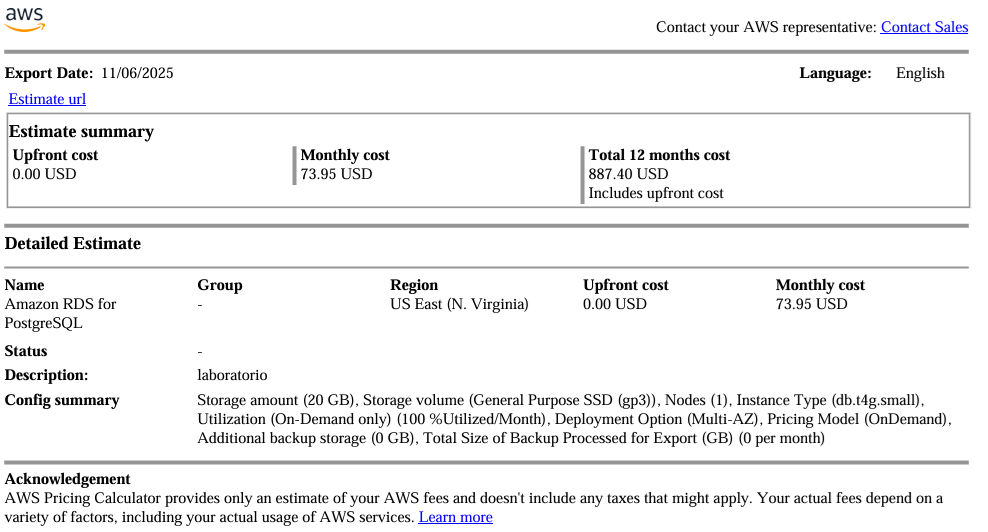
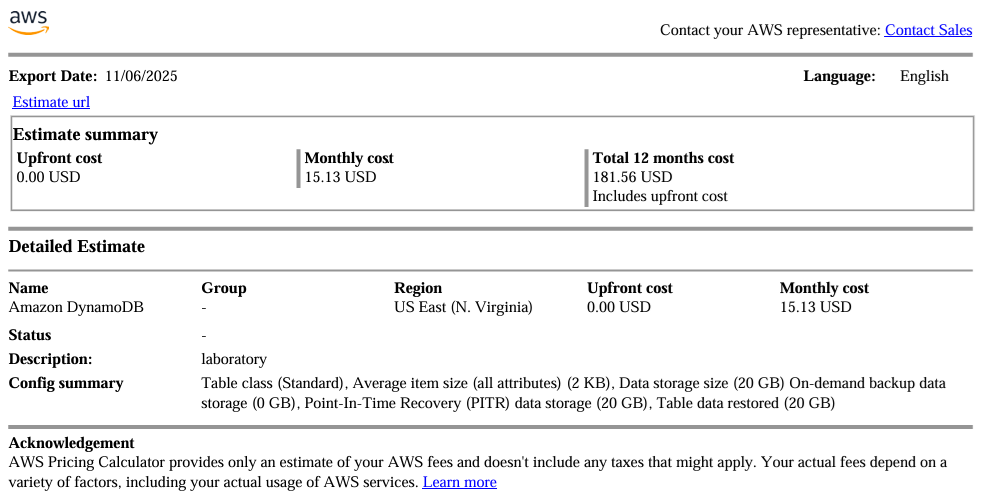
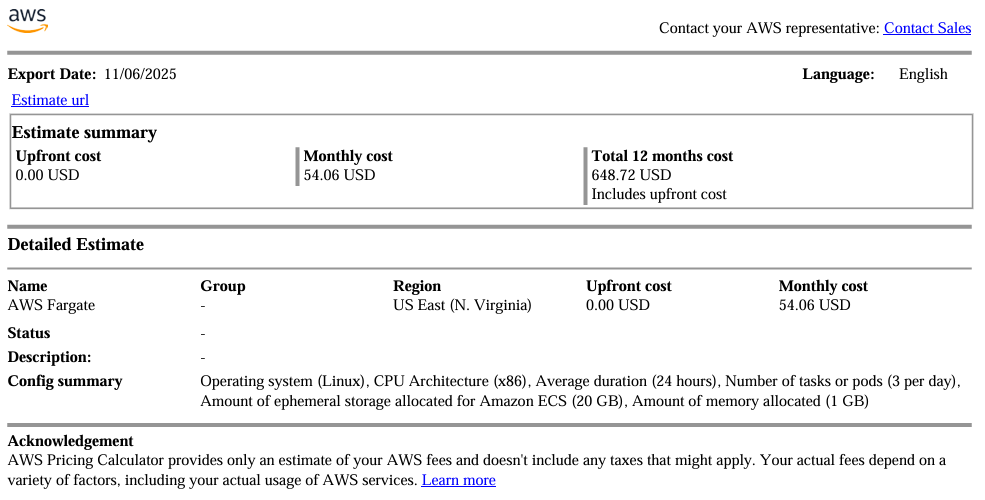
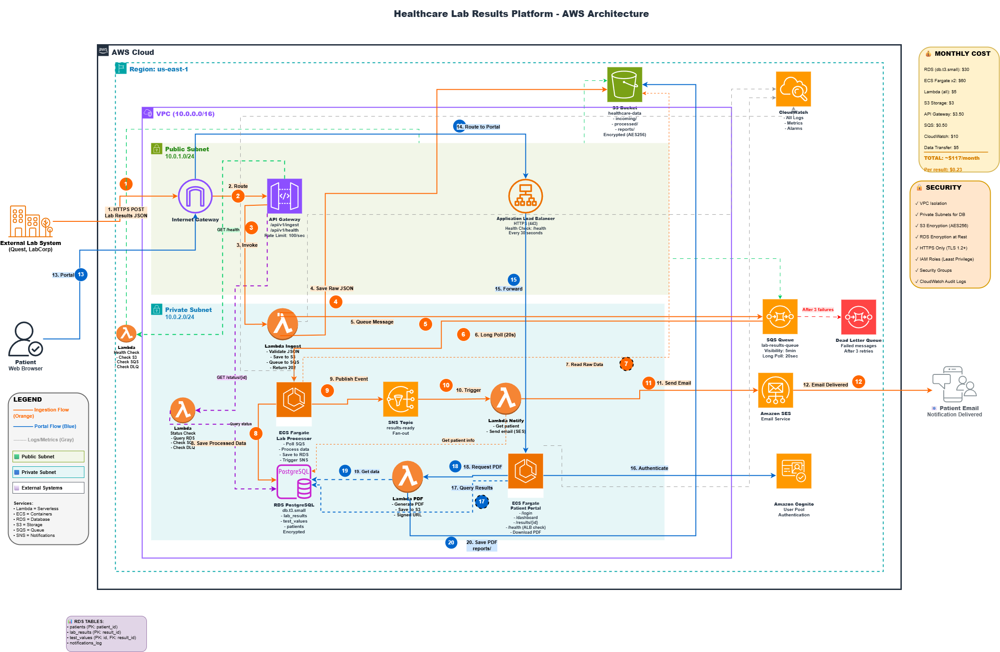

# Healthcare Lab Results Processing Platform - Final Project

---

# Infrastructure Documentation

---

## 1. Technology Decisions

### Database Choice: [RDS/DynamoDB]

**Decision:** We chose **RDS (PostgreSQL)** because it best supports our business logic through **foreign keys**, which are critical for maintaining data integrity in a health system. It also offers superior query flexibility and we are more familiar with the relational model.

**Trade-offs considered:**

* **Option A: RDS (PostgreSQL)**
    * **Pros:** Guarantees referential integrity at the database level, offers powerful and flexible querying with SQL, and has a large community.
    * **Cons:** It is not serverless, and we pay for the instance per hour, even when idle.

* **Option B: DynamoDB**
    * **Pros:** Excellent flexibility in its structure (schemaless), it is fully serverless, you pay only for what you use, and it handles JSON data natively.
    * **Cons:** There is no built-in referential integrity (must be managed by the application), and complex analytical queries are very difficult to implement.

**Justification:**
We decided to accept the significantly higher monthly cost of RDS compared to DynamoDB because it provides **guaranteed data integrity**. Relying only on application-level validation (as we would with DynamoDB) introduces a risk that a healthcare system cannot afford to take. The database-level integrity provided by foreign keys justifies the higher cost.

**Cost comparison**

   * RDS (Postgrest)

   * DynamoDB

---
### Decision 2: Compute Choice for Processing Workers

   * Option A - ECS on EC2: This is a hybrid option. The ECS service gives us scalability and resilience, but we still have to manage the EC2 servers completely.

   * Option B - ECS on Fargate: This is serverless. The only thing we do is provide the Docker container.

   * Option C - EC2 with custom scripts: This is not scalable, we have to manage everything, it is not resilient, and it doesn't meet the project's requirements

   **Cost comparison**
   * ECS Fargate

   * EC2

**Decision:** ECS on Fargate:

**Justification:**
   We chose **ECS on Fargate** and accepted the extra cost because it's serverless. This lets us avoid worrying about any administration, security, updates, or patching

---
### Decision 3: Authentication Strategy

**Required**: Use Cognito but you can choose:

   * User Pools only (simple username/password)
   * User Pools + Identity Pools (for direct AWS resource access)
   * User Pools + Social Identity Providers (Google, Facebook)

* **Option A: User Pools only (simple username/password)**
   * **Pros:** 
     - Simple to implement and maintain
     - Lower complexity for users (familiar login experience)
     - No additional external dependencies
     - Sufficient security for patient portal access
     - Built-in password policies and MFA support
   * **Cons:** 
     - Users must create and remember another password
     - No social login convenience
     - Limited to Cognito-managed identities
* **Option B: User Pools + Identity Pools (for direct AWS resource access)**
   * **Pros:** 
     - Allows patients to access AWS resources directly
     - More flexible for future features
     - Better for mobile apps
   * **Cons:** 
     - Added complexity we don't currently need
     - Our portal mediates all AWS access, so direct access isn't required
     - Increases attack surface unnecessarily
* **Option C: User Pools + Social Identity Providers (Google, Facebook)**
   * **Pros:** 
     - Better user experience (no new password to remember)
     - Faster registration/login
     - Reduced password reset requests
   * **Cons:** 
     - Healthcare data sensitivity may make patients uncomfortable with social logins
     - Additional privacy/compliance considerations
     - Dependency on external providers (Google/Facebook outages affect our system)
     - HIPAA compliance requires careful configuration with third-party IdPs

**Decision:** We chose **User Pools only** (simple username/password)

**Justification:**

We chose **User Pools only** for the following reasons:
   * - We don't need direct AWS resource access
   * - Healthcare systems don't need external providers
   * - Faster development and lower maintenance

---

## 2. Architecture Diagram

---
## 3. Data Flow Documentation

**Flow 1: Data Ingestion (From Lab to Email)**

1. An external lab sends a patient’s results as a JSON file to our public API.
2. The request goes through the Internet Gateway and reaches **API Gateway**.
3. **API Gateway** checks access (API keys) and rate limits. If OK, it calls the **Ingestion Lambda**.
4. The **Ingestion Lambda** does three things:
   * Checks the JSON format.
   * Saves a copy of the original file to **S3** (audit).
   * Sends a message to **SQS** with the S3 file location.
5. **SQS** stores the message safely. It **does not push**; it waits for a worker to read it.
6. An **ECS Fargate** worker long-polls SQS. When it gets a message, it:

   * Reads the raw JSON from **S3**.
   * Cleans and validates the data.
   * Saves processed data into **RDS**.
   * Publishes a notification to **SNS**.
7. **SNS** triggers the **Notification Lambda**.
8. The **Notification Lambda** looks up the patient’s email in **RDS** and uses **SES** to send an email saying results are ready.

**Flow 2: Patient Portal (From login to Download)**
9) The patient gets the email and opens the portal in the browser.
10) The request goes through the Internet Gateway to the **ALB** (load balancer).
11) The **ALB**:

* Handles HTTPS.
* Checks health
* Sends traffic to the portal app (**ECS**).

12. The **ECS Portal** app sees the user isn’t logged in and redirects to **Cognito** to sign in.
13. After login, the portal queries **RDS** to get all results for that patient.
14. The patient clicks download PDF. The portal calls the **PDF Lambda**.
15. The **PDF Lambda**:
   * Generates the PDF.
   * Saves it in **S3** under `reports/`.
   * Returns a **signed URL** (temporary secure link). The browser uses it to download the file.

## 4. Security Model

   * Network Isolation Strategy
      * - Public Subnet: Contains only components that need to receive internet traffic.
      * - Private Subnet: Contain all components that interact with our data.

   * Data Encryption 
   This applies to all sensitive data, both in-transit and at-rest.
      * - Data in Transit: All public communication will use HTTPS (TLS 1.2+).
      * - Data at Rest: Storage locations:
         * - RDS: AES-256 - The entire database.
         * - S3 Buckets: SSE-S3 - Original JSON, processed data, and generated PDFs
         * - SQS: SSE-SQS - Messages in the processing queue.
         * - EBS Volumes: AES-256 - Disks for the ECS containers.

   * Credential Management and IAM Roles 
   The principle of least privilege will be followed for every service, meaning it only has permission to do exactly what it needs, nothing more.

   * Logging and Monitoring 
   All access and actions are logged automatically.

